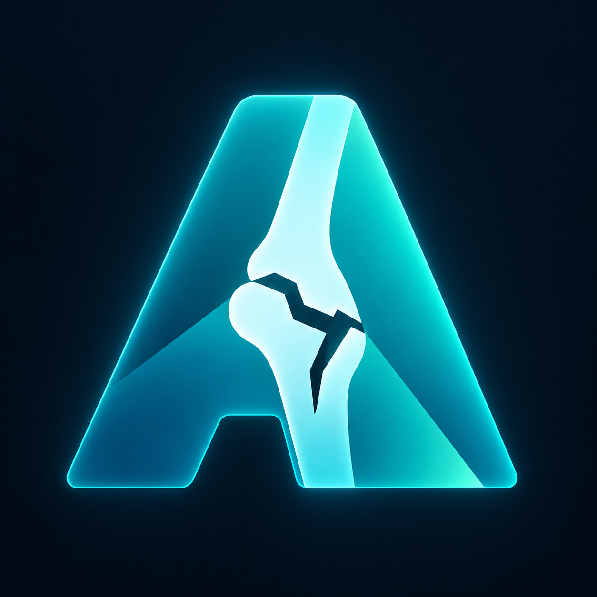
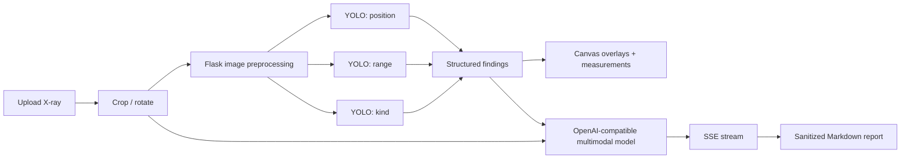

<div align="center">

# Astra-FractureAI

### An AI-assisted X-ray fracture screening workbench for research and education

<p>
  
</p>

<p>
  <strong>Upload an X-ray → detect fracture signals with three parallel YOLO tasks → review visual overlays → stream an AI-assisted explanation.</strong>
</p>

<p>
  <a href="#quick-start">Quick start</a> ·
  <a href="#how-it-works">How it works</a> ·
  <a href="frontend/README.md">Frontend</a> ·
  <a href="test/README.md">Testing</a>
</p>

<p>
  
  
  
  
</p>

</div>

> **Research preview · Not a medical device.** This project is for engineering research, education, and demonstration only. Do not upload real patient X-rays or protected health information (PHI). Its output must not be used as a substitute for qualified medical judgment.

## Why Astra-FractureAI?

Astra-FractureAI turns a multi-stage fracture-screening pipeline into an inspectable browser workflow. It combines structured detection signals with a multimodal explanation layer, while keeping the image viewer, overlays, request lifecycle, and streaming response visible to the person reviewing the result.

The project is intentionally designed as a **demo-friendly research preview**:

- **Three parallel detection tasks** for fracture `position`, `range`, and `kind`.
- **A visual workbench** with crop, rotate, zoom, pan, window/level, length, and angle tools.
- **Coordinate-aware overlays** projected from the preprocessed model image back onto the source view.
- **OpenAI-compatible multimodal reasoning** with primary/fallback model routing.
- **Streaming Markdown output** over SSE, rendered through `marked` and `DOMPurify`.
- **Same-origin delivery** from Flask with no npm, Vite, or frontend build step.

## How it works



### Product flow

| Stage | What the reviewer sees |
|---|---|
| **Prepare** | Drag in a PNG/JPEG X-ray, crop it, or rotate it before analysis. |
| **Detect** | Tune confidence, IoU, and inference size, then run the three detection tasks in parallel. |
| **Inspect** | Review confidence-ranked result cards and position/range overlays on the canvas. |
| **Measure** | Use window/level, zoom, pan, rotation, length, and angle tools for visual inspection. |
| **Explain** | Stream a structured AI-assisted explanation while preserving the raw Markdown response. |

## Technology

| Layer | Technology |
|---|---|
| Backend | Python, Flask, Flask-CORS |
| Image pipeline | Pillow, EXIF-aware orientation handling, resize and JPEG preprocessing |
| Detection | Three configured Ultralytics Cloud YOLO endpoints, executed concurrently |
| Explanation | OpenAI-compatible multimodal API with primary/fallback routing |
| Frontend | Vue 3, Element Plus, Cropper.js, Canvas API |
| Streaming and rendering | Fetch/ReadableStream, Server-Sent Events, marked, DOMPurify |
| Delivery | Flask serves the frontend and `/api/*` routes from one origin |

## Quick start

### 1. Create an environment

Use Python 3.12 or newer. A virtual environment is recommended:

```bash
python -m venv .venv

# macOS / Linux / Git Bash
source .venv/bin/activate

# Windows PowerShell
.venv\Scripts\Activate.ps1
```

Install dependencies:

```bash
python -m pip install -r requirements.txt
```

### 2. Configure external services

Copy the template:

```bash
cp .env.example .env
```

On Windows PowerShell:

```powershell
Copy-Item .env.example .env
```

Fill in the required external service configuration in `.env`, including:

- `YOLO_API_KEY`
- `YOLO_BASE_URL_POSITION`
- `YOLO_BASE_URL_RANGE`
- `YOLO_BASE_URL_KIND`
- `OPENAI_API_KEY`
- `OPENAI_BASE_URL`
- the selected primary/fallback model settings

Never commit `.env` or put real credentials in an issue, screenshot, test artifact, or README.

### 3. Start the local demo

```bash
python app.py
```

Open the port configured by `PORT` in `.env`. If `PORT` is not set, the application defaults to `8080`:

```text
http://localhost:<PORT>/
```

There is no separate frontend command. Flask serves the Vue application and the API from the same origin. The browser loads pinned frontend dependencies from `unpkg.com`, so the first page load requires access to that CDN.

> This command starts the Flask development server for local demonstration. It is not a production deployment recipe; use a production WSGI setup, authentication, rate limiting, and a reviewed reverse-proxy configuration before any public exposure.

## API overview

| Method | Route | Purpose |
|---|---|---|
| `GET` | `/` | Serves the Vue single-page workbench. |
| `GET` | `/frontend/<path>` | Serves frontend assets. |
| `GET` | `/api/health` | Reports service status and configured model availability without returning credentials. |
| `POST` | `/api/detect` | Accepts `multipart/form-data` with an image and detection parameters; runs the three YOLO tasks. |
| `POST` | `/api/explain` | Accepts an image payload and structured findings; returns a regular or SSE-streamed multimodal explanation. |

### Detection parameters

`POST /api/detect` accepts:

- `file`: PNG or JPEG from the browser workflow, up to 20 MB at the application validation layer.
- `conf`: `0.01`–`1.00`.
- `iou`: `0.00`–`0.95`.
- `imgsz`: `320`, `640`, or `1280`.

The response includes the preprocessed `image_size`, model outputs, per-model timing, and partial-failure information.

### Explanation output

`POST /api/explain` accepts JSON containing `image_base64` and `yolo_result`. Set `stream: true` to receive `text/event-stream` chunks, terminated by a single `[DONE]` event. The frontend buffers chunks across network boundaries and sanitizes rendered Markdown before inserting it into the page.

## Testing

### Deterministic core tests

Run the local contract and utility checks first:

```bash
python test/test_app.py
```

These checks cover image validation, thinking cleanup, API input validation, model routing, SSE framing, safe errors, and static routes. See [`test/README.md`](test/README.md) for the current test map.

### Opt-in remote E2E test

```bash
python test/test_e2e.py
```

This is **not** an offline test. It calls the configured remote YOLO and LLM services, uses local sample images, may incur API costs, and writes local result artifacts. Run it only after reviewing the privacy, data-processing, and cost implications. Do not use real patient images or PHI.

## Safety and limitations

- This is a research preview, not a medical device.
- It does not provide a diagnosis, triage decision, or treatment plan.
- AI-generated explanations can be incomplete, incorrect, or inconsistent.
- The project depends on external model endpoints, so availability, latency, quotas, and data-processing policies are provider-dependent.
- The default local server is not hardened for public internet exposure.
- Upload only synthetic, public, or explicitly authorized non-sensitive images.
- A qualified clinician must independently review any medically relevant material.

## Repository map

```text
Astra-FractureAI/
├── app.py                 # Flask routes, model routing, SSE, static delivery
├── image_service.py       # Image validation and preprocessing
├── thinking.py            # Model reasoning cleanup helpers
├── yolo_service.py        # Concurrent YOLO service client
├── llm_service.py         # Prompting, streaming, and fallback routing
├── frontend/
│   ├── index.html         # CDN dependencies and application shell
│   ├── app.js             # Home view and application bootstrap
│   ├── workbench-template.js
│   ├── workbench-view.js  # Viewer, controls, requests, and rendering
│   ├── ui-text.js         # Detection label mapping
│   ├── style.css
│   └── README.md          # Frontend implementation notes
├── test/
│   ├── test_app.py        # Deterministic local checks
│   ├── test_e2e.py        # Opt-in remote integration test
│   └── README.md          # Test policy and privacy guidance
├── .env.example           # Safe configuration template
├── requirements.txt
└── README.md
```

## License

No license has been selected for this repository yet. Until a license is added, do not assume that the source, screenshots, or sample data may be reused or redistributed.
